# Online News Platform (MERN Stack)

A comprehensive and modern online news application built using the **MERN Stack** — **MongoDB**, **Express.js**, **React.js**, and **Node.js**.

This platform offers two fully-featured interfaces:

- **Admin Dashboard** – for content moderation, scheduling, and user management  
- **User Dashboard** – for news exploration, filtering, personalization, and real-time updates  

---

## 📌 Overview

Designed to support **digital journalism**, this platform includes:

- Real-time news updates  
- Live news streaming  
- Poll and weather integration  
- Role-based dashboards  
- Modular, scalable architecture  
- External news fetched via NewsAPI  
- State-wise and Category-wise filtering via dropdowns  

---

## 📂 Table of Contents

- [Introduction](#introduction)
- [Features](#features)
- [Detailed Feature Overview](#detailed-feature-overview)
- [Project Structure](#project-structure)
- [Tech Stack](#tech-stack)
- [Screenshots](#screenshots)
- [Contributors](#contributors)

---

## Introduction

The Online News Platform provides a **scalable** and **modular** approach to delivering and managing digital content.  

- The **Admin Panel** supports article creation, live updates, poll handling, and user moderation.  
- The **User Interface** is optimized for real-time news consumption with categorized news, trending content, and an interactive experience.  
- News is also fetched from **NewsAPI** to enhance variety and update freshness.

---

## Features

### 🔐 Authentication & Access Control

This platform includes a fully functional authentication flow built using **JWT**, **middleware**, and **role-based routing**.

### 🔑 Key Features

#### 🧾 Login/Register Pages
Users and admins access the system through separate forms. Both pages include:
- Proper field validation
- Error and success handling
- Clean responsive styling

#### 🔐 JWT-Based Authentication
- Upon login, a signed token is issued using **JSON Web Tokens**
- This token is stored securely in `localStorage`
- All protected API routes use this token for authentication

#### 🔒 Secure Password Hashing
- User passwords are hashed using `bcrypt.js`
- Ensures strong encryption even in the event of a database breach

#### 🚦 Role-Based Routing
After login, the system checks the user’s role and redirects accordingly:
- `/admin/dashboard` → for Admin users
- `/user/dashboard` → for regular Users

#### 🧰 Protected Routes with Middleware
Custom backend middleware is used to protect routes:
- `authMiddleware.js` – Verifies JWT token and extracts user data
- `adminMiddleware.js` – Ensures only admins access admin routes

#### 🌐 Global AuthContext
- Uses **React Context API** (`AuthContext.jsx`)
- Manages global session state: token, role, and user info
- Accessible from any component for conditionally rendering based on auth state

#### ⏳ Token Expiry and Auto Logout
- Each session is verified on page load or route access
- If the token is invalid or expired:
  - The user is logged out
  - Redirected to `/login` automatically

---


---

## Admin Capabilities

- **Comprehensive News Management**: Create, update, and delete news items for multiple categories such as headlines, live updates, special news, recent stories, and highlighted content. This gives editors full control over the news lifecycle from draft to publish.
  
- **Poll Creation & Analytics**: Admins can create polls, define choices, track real-time voting stats, and analyze responses from users. Useful for gauging reader sentiment.

- **User Role Management**: View a list of registered users, update their roles (e.g., promote to moderator), or delete users violating terms. Admin can also disable accounts or reset credentials.

- **Comment Moderation**: View, approve, delete or flag comments. Helps maintain quality discussions and control spam or offensive content.

- **Scheduled Publishing**: News articles can be drafted and scheduled for later publication using a time picker system. This enables editors to work ahead of time.

- **Homepage Control Panel**: Dynamically decide what to display in Highlights, Headlines, or Featured sections by toggling article status in admin dashboard.

- **Analytics & Dashboard Insights**: Admin Dashboard shows daily user activity, published news stats, poll engagement charts, and search trends.

---

## User Dashboard

- **Live News Feed**: Users get real-time updates of breaking news using dynamic components that fetch and display news every few seconds.

- **External News via NewsAPI**: News articles are also dynamically fetched from [NewsAPI](https://newsapi.org), enhancing the news coverage and keeping the platform up-to-date with global and national headlines.

- **Category-wise and State-wise Filtering**: Users can select news based on **category** (sports, tech, politics, etc.) or **state/region** from a dropdown list. This ensures a personalized and localized reading experience.

- **Intelligent News Recommendations**: Based on what users search, read, or bookmark, the system displays `TopRecommendedNews` or `TopSearchedNews`.

- **Interactive Poll Participation**: Users can vote in live polls directly from the dashboard and view results once submitted.

- **Bookmark & Reading History**: Logged-in users can bookmark news and revisit them later through a saved section.

- **Review & Feedback System**: Readers can rate their experience and write detailed feedback using the `ReviewForm.jsx` component. Admins review this on the backend.

- **Weather Widget Integration**: Location-based weather info is shown in a widget powered by OpenWeatherMap API through `WeatherPage.jsx`.

- **Mobile-Responsive Interface**: Optimized using Tailwind CSS for devices of all sizes with accessible tab navigation, dark/light mode, and fast transitions.

- **Search Suggestions & History**: Smart search input offers auto-suggestions based on trending keywords and previous searches.

---

## Detailed Feature Overview

- **Dual Dashboards**: Separate interfaces for admin and users  
- **Modular News Types**: Headlines, Highlights, Live Updates, Recent News, etc.  
- **Live Streaming**: Updates shown in real-time for breaking news  
- **NewsAPI Integration**: External news fetched and displayed from NewsAPI  
- **Dropdown Filters**: Select state or category to browse relevant news  
- **Poll System**: Admins create polls, users vote, backend analytics track results  
- **Filtering Options**: Sort and search by tag, category, and popularity  
- **Engagement Tools**: Comments, threaded replies, moderation support  
- **Recommendation Engine**: Highlights trending and popular articles  
- **Weather Widget**: Embedded via `WeatherPage.jsx`  
- **Newsletter Subscription**: Handled through `SubscriptionPage.jsx` and backend  
- **Performance Optimization**: Lazy loading, skeletons, and mobile-first UI  

---

## Project Structure

```
online-news-platform/
├── backend/
│   ├── Models/
│   ├── middleware/
│   ├── routes/
│   ├── images/
│   ├── public/
│   ├── seeders/
│   ├── .env
│   ├── server.js
│   └── package.json
│
├── frontend/
│   └── src/
│       ├── Auth/
│       ├── components/
│       │   ├── admin/
│       │   └── user/
│       ├── App.js
│       ├── index.js
│       ├── App.css
│       └── index.css
├── README.md
└── package-lock.json
```

---

## Tech Stack

### 🖥️ Frontend

<p align="center">
  <a href="https://reactjs.org">
    
  </a>
  <a href="https://reactrouter.com">
    
  </a>
  <a href="https://axios-http.com">
    
  </a>
  <a href="https://tailwindcss.com">
    
  </a>
  <a href="https://getbootstrap.com">
    
  </a>
</p>

---

### 🔧 Backend

<p align="center">
  <a href="https://nodejs.org">
    
  </a>
  <a href="https://expressjs.com">
    
  </a>
  <a href="https://www.mongodb.com">
    
  </a>
  <a href="https://mongoosejs.com">
    
  </a>
  <a href="https://jwt.io">
    
  </a>
</p>

---

### ⚙️ Others

<p align="center">
  <a href="https://cloudinary.com"></a>
  <a href="https://github.com/expressjs/multer"></a>
  <a href="https://openweathermap.org"></a>
  <a href="https://newsapi.org"></a>
  <a href="https://git-scm.com"></a>
  <a href="https://github.com"></a>
</p>

---

## Screenshots

### Login/Register Page

<p align="center">
  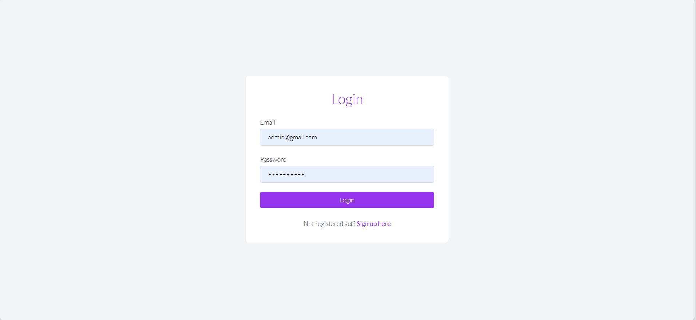
  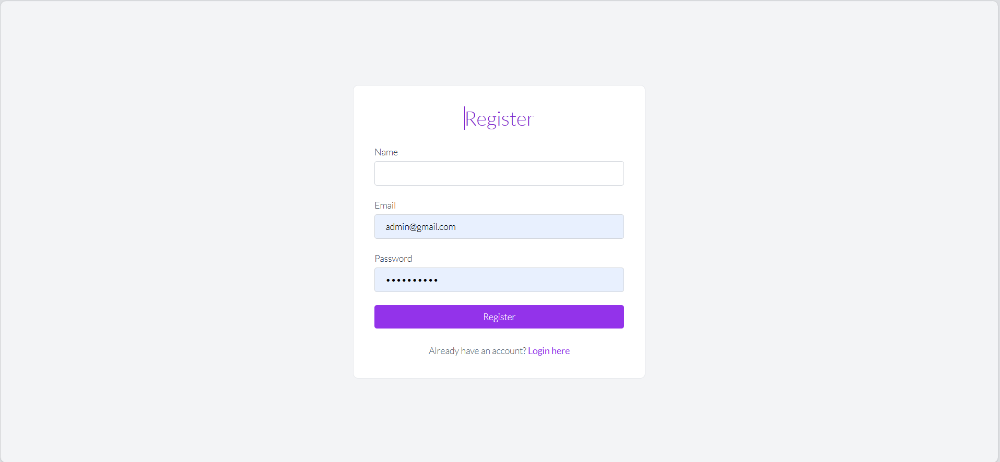
</p>

### Admin Dashboard

<p align="center">
  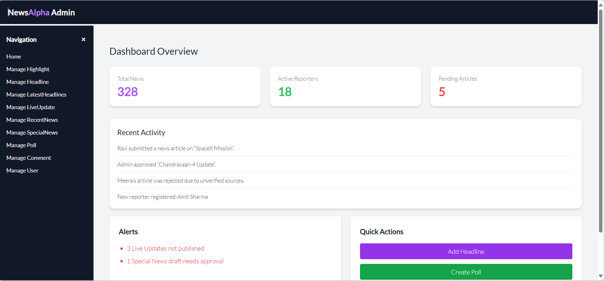
  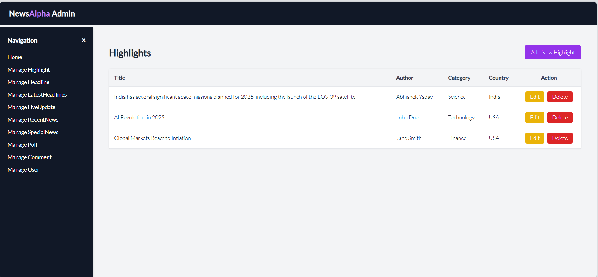
  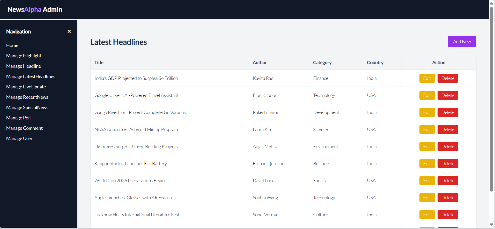
  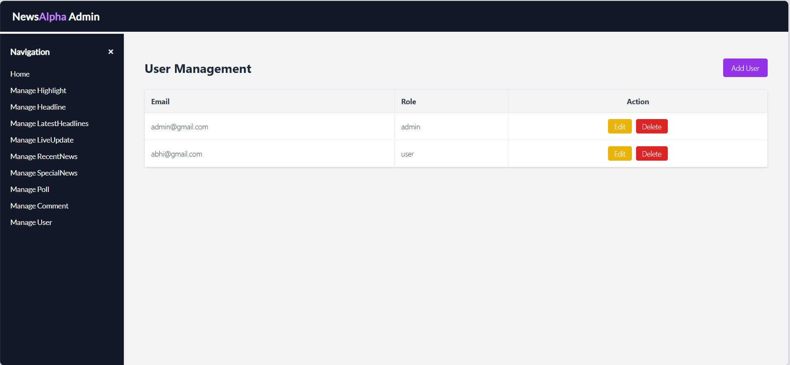
</p>

### User Dashboard

<p align="center">
  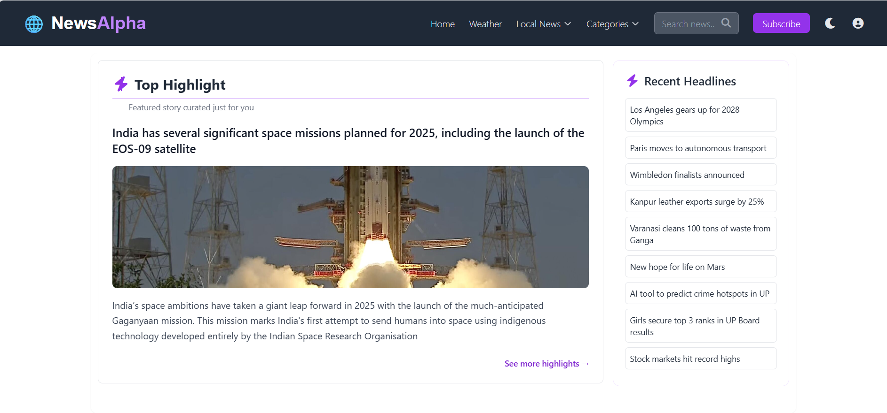
  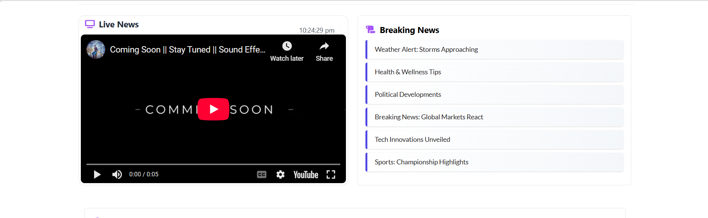
  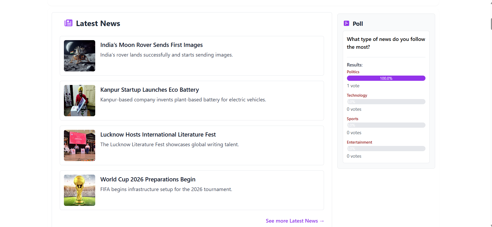
  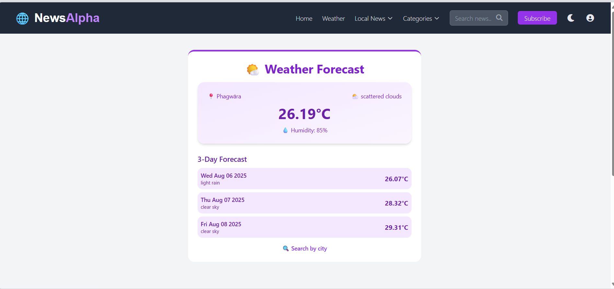
  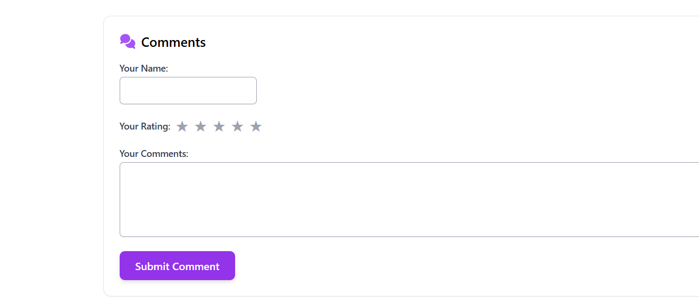
  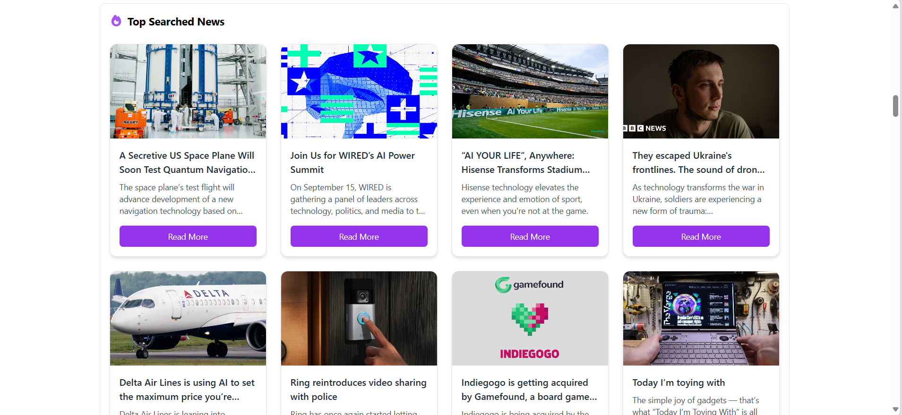
</p>


---

## Contributors

- **Abhishek Yadav** – Full Stack Developer  

---

